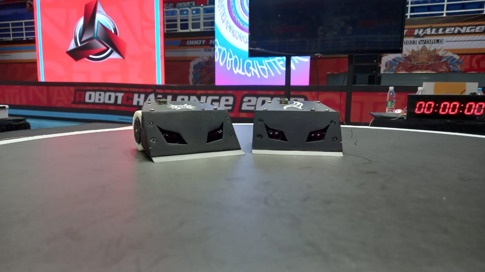
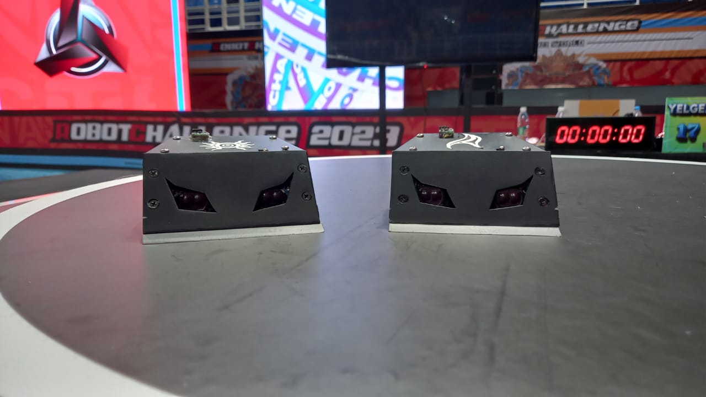
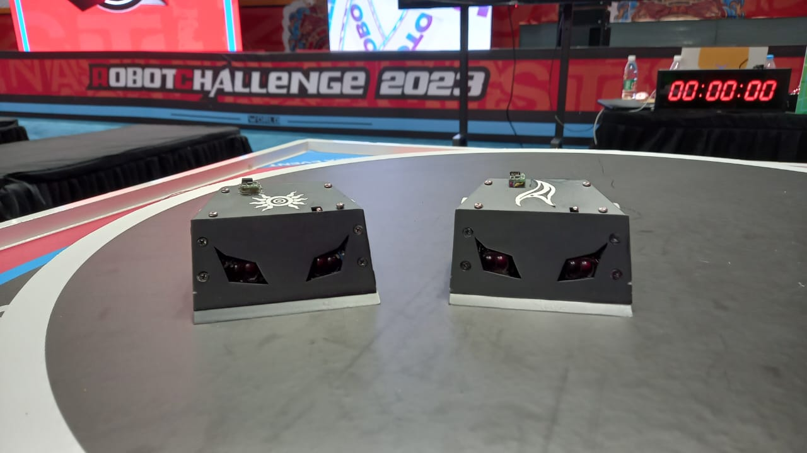
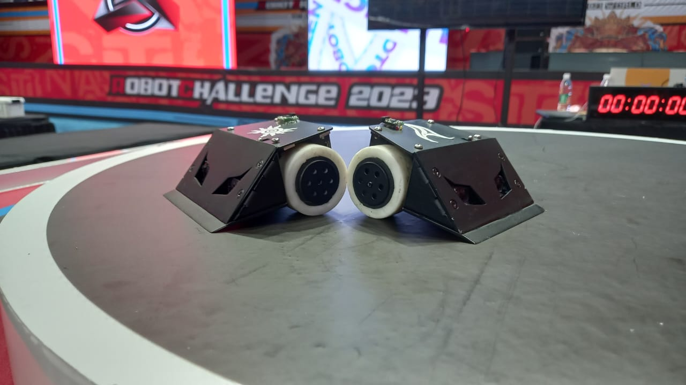

# Lina and Shen (siblings/twins) sumo robots

## Lina

* Release date: 23. Jul 2023
* Old fullname: Ling Crowbar
* Pronoun: she/her

### *Specs*

* Microcontroller: `RP2040` (dual core)
* 2 digital sensors 80cm (eyes)
* 4 analog field (boarders) sensors
* `TB6612` motor-driver
* start module (for international championships)

## Shen

* Release date: 21. Jul 2023
* Old fullname: Shen Crankcase
* Pronoun: he/him

### *Specs*

* Microcontroller: `RP2040` (single core)
* 2 digital sensors 80cm (eyes)
* 4 analog field (boarders) sensors (works only 3)
* `TB6612` motor-driver
* start module (for international championships)

## Source code information

### Code map

* `name.h` - main header file
* `name.defs.h` - macroses and defines
* `name.motors.h` - `TB6612` driver functions
* `name.rc.h` - for remote controle (start module)
* `name.serial.h` - for debugging

## Gallery

